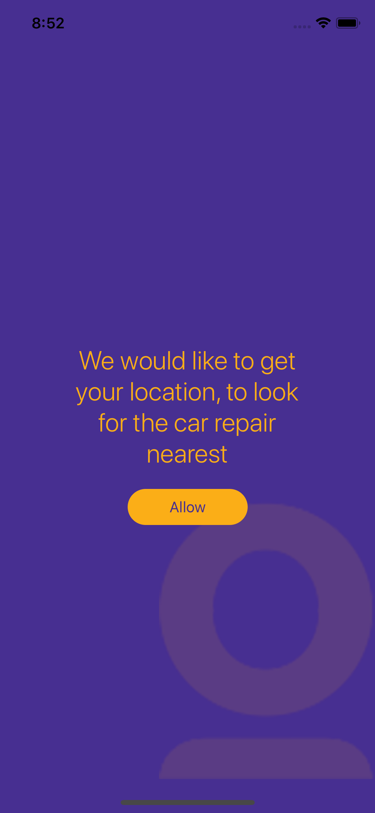
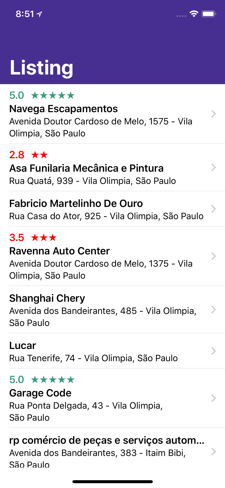
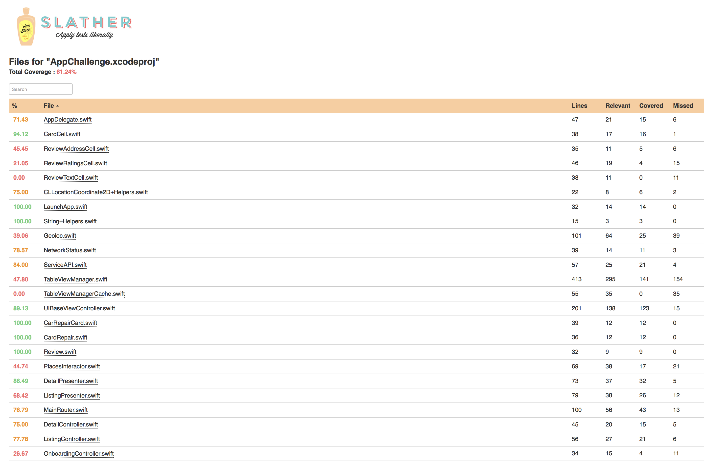

# Youse challenge
Show me the code

## Schemes

Please select the production scheme to see the real data

#### AppChallenge Release

Access to Google Service API

#### AppChallenge Debug

Local files for testing

## Architecture

### Project Targets

#### AppChallengeTests

Implements unit tests.

#### AppChallengeUITests

Implements UI tests.

### Cocoapods Dependencies (Own Library)

#### ConfigurationProvider

This is a library for centering settings of your app.

[https://github.com/jjfernandes87/ConfigurationProvider](https://github.com/jjfernandes87/ConfigurationProvider)

#### LaunchApplication
This is a library for you to create a sequence of initialization of simple and fast.

[https://github.com/jjfernandes87/LaunchApplication](https://github.com/jjfernandes87/LaunchApplication)

## API Integrations

[https://developers.google.com/places/web-service/](https://developers.google.com/places/web-service/)

## How to Run

First of all, you need to install Bundler. Bundler will make sure all developers working on the project use the same versions of services like Cocoapods and Fastlane.

Open a Terminal and install Bundler using the command:

```
gem install bundler
```

In order to run the application, perform the following commands:

```
cd show-me-the-code
bundle install
```

The last command will install all the dependencies needed for running the application, such as Cocoapods and Fastlane. Then, perform the following command in order to install Cocoapods dependencies:

```
bundle exec pod install
```

## How to Test

If you want to run tests locally, just use Fastlane:

```
bundle exec fastlane tests
```

If you want to see test coverage

```
bundle exec fastlane coverage
```

If you want to see the screenshots 

```
bundle exec fastlane screenshots
```

## Screenshots

<p align="center">
  
  
  
</p>

## Coverage

<p align="center">
  
</p>


